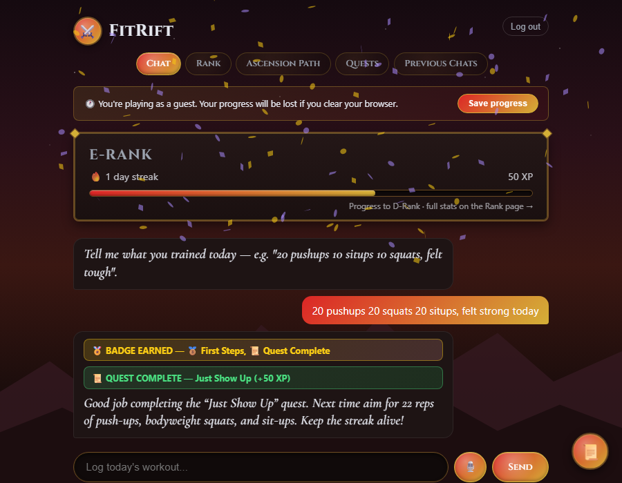

# ⚔️ FitRift

**A bodyweight fitness RPG website, inspired by my own love of working out and gaming growing up. Tell it what you trained in plain English, and watch your Hunter rank climb from E to S.**


**[Live demo →](https://fit-rift.vercel.app)**, click "Guest Mode" to try it instantly with no signup (backend is on a free tier and may take ~30s to wake up on the first request)



## Why

Most fitness trackers make you fill out forms: pick an exercise from a dropdown, type a number, hit save. FitRift instead reads a plain-English message like *"20 pushups 15 squats, felt tough"*, figures out what you did, and turns it into RPG progress: XP, stat growth, personal records, and a rank that only ever measures you against your own history, never against anyone else.

Personally, this one wasn't just a portfolio exercise. I'm into fitness and pushing myself physically, and I grew up on games, so a project that turns real workouts into RPG-style progression was something I actually wanted to use myself, not just build. The exercises it tracks are the ones I actually train with, so it's genuinely my own workout log now, not just a demo.

## Features

- **Natural-language logging**: type or speak what you trained (`"ran 3km"`, `"15 curls with 20lb dumbbells"`) and a Groq-hosted LLM parses it into structured sets, including reported effort (RPE)
- **Voice input**: log a workout by talking, via the browser's native speech recognition
- **Baseline-relative XP**: your first log of an exercise sets the baseline; every session after that earns XP for improving on *your* history, not a generic standard
- **Five RPG stats** (Strength, Endurance, Vitality, Agility, Discipline) that grow based on which exercises you log and how consistently you show up
- **The Ascension Path**: push-up, pull-up, and squat progressions unlock tier by tier as you cross rep thresholds, visualized as a chain from beginner to advanced variants
- **Multi-requirement Hunter ranks (E through S)**: rank-up needs XP *and* a minimum lifetime workout count *and* a minimum lifetime rep count together, not just one number going up
- **Streaks with a grace day**: one missed day doesn't reset your streak, two in a row does
- **A rotating quest board**: daily and weekly quests are randomly picked from a pool (run a distance, hit a rep target, complete a multi-exercise circuit) and reward both bonus XP and specific stat points
- **Personal records & progression unlocks**: every new best is tracked per exercise, with celebratory banners and confetti when you set one
- **Badges** for milestones: first workout, first PR, first quest, and one per rank achieved
- **Guest mode**: try the whole app instantly with no signup (an anonymous Supabase session), then add an email and password later to keep the same progress permanently
- **A dedicated Rank page**: full stat breakdown, next-rank checklist, and your earned/locked badge collection, with a compact live version on the Chat page too
- **Previous Chats**: every past workout log, with the exact message you typed and how it was parsed, browsable at any time
- **A hand-drawn hunter-guild look**: gold-trimmed ornate panels, skill-tree-style progression medallions, a mountain-dusk background, and a floating scroll of original motivational quotes
- **Real accounts**: Supabase Auth backs signup/login, so progress is tied to you, not a browser session

## How it works

```
"20 pushups 15 squats, felt tough"
              │
        Groq LLM (JSON mode) ──► structured entries + effort rating
              │
   first time logging this exercise? ──yes──► set as baseline (no XP yet)
              │ no
              ▼
   XP vs. baseline + personal records + progression unlocks
              │
   quest progress (random daily/weekly pool) + character stats + streak/rank
              │
   React UI: rank card, Ascension Path, Quest Board, with confetti
```

1. **Parsing** ([index.js](index.js)): the raw message is sent to Groq (`openai/gpt-oss-120b`) in JSON mode, which extracts exercises, reps/distance/duration, weight used (for weighted moves), and an optional effort (RPE) rating.
2. **Progress engine**: each logged set is compared against the user's personal baseline for that exercise to compute XP, checked against personal records, checked against progression-chain unlock thresholds, and rolled into five weighted RPG stats.
3. **Quests**: a deterministic-per-user random pick from a pool of daily/weekly quest templates (total reps, a specific exercise's distance/reps, a multi-exercise circuit, workout consistency, effort reporting) tracks live progress and pays out XP plus, for some quests, a direct stat bonus.
4. **Rank**: Hunter rank (E through S) is recomputed from cumulative XP, lifetime workout count, and lifetime rep count together, so climbing requires well-rounded consistency, not just XP farming.
5. **Frontend** (React + Vite): a chat log with a live rank/quest summary, a dedicated Rank page with full stats and badges, the Ascension Path progression map, and a Quest Board showing the full quest pool.

## Tech stack

| Layer | Tool |
|---|---|
| Backend | Node.js, Express |
| Database | PostgreSQL (Supabase), Prisma ORM |
| Auth | Supabase Auth (JWT) |
| LLM | Groq (`openai/gpt-oss-120b`, JSON mode) |
| Frontend | React, Vite, React Router |
| Animation/FX | Framer Motion, canvas-confetti |
| Voice input | Web Speech API |

## Setup

1. Create a [Supabase](https://supabase.com) project for the database and auth.
2. Backend: in the project root, create a `.env` with:
   ```
   DATABASE_URL=<supabase pooled connection string>
   DIRECT_URL=<supabase direct connection string>
   GROQ_API_KEY=<your Groq API key>
   SUPABASE_URL=<your Supabase project URL>
   SUPABASE_PUBLISHABLE_KEY=<your Supabase publishable key>
   SUPABASE_SECRET_KEY=<your Supabase secret key>
   ```
   Then:
   ```bash
   npm install
   npx prisma migrate deploy
   node seed_exercises.js
   node seed_badges.js
   node index.js
   ```
3. Frontend: in `frontend/`, create a `.env` with:
   ```
   VITE_SUPABASE_URL=<your Supabase project URL>
   VITE_SUPABASE_PUBLISHABLE_KEY=<your Supabase publishable key>
   ```
   Then:
   ```bash
   npm install
   npm run dev
   ```

## License

MIT. See [LICENSE](LICENSE).
